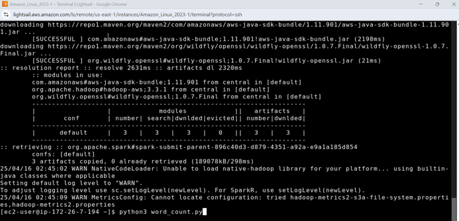
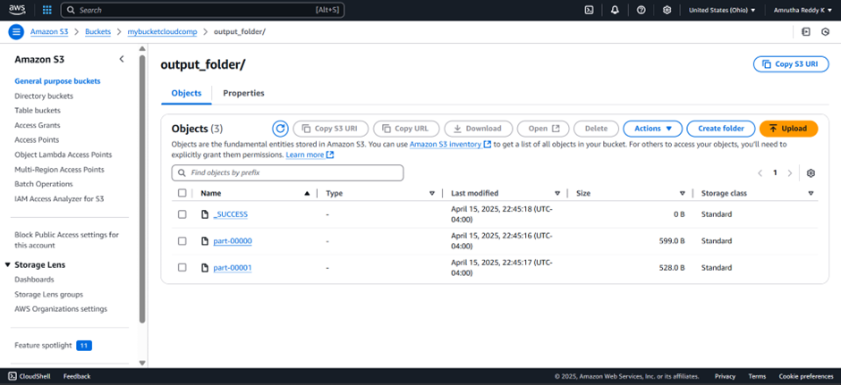
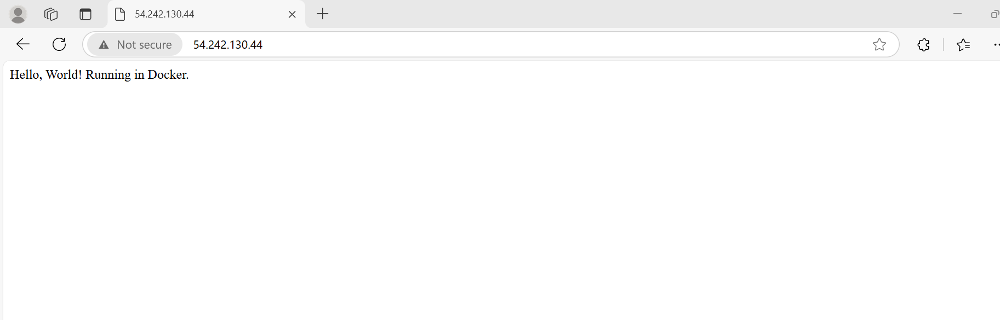

### Word Count on AWS with PySpark, Node.js Deployment, and ETL Pipeline
Project 1: Word Count on AWS EC2/LightSail using PySpark
Objective
Set up PySpark on an AWS instance to count words in a text file stored in an S3 bucket.

1. Prerequisites
Ensure you have:

An AWS account with access to EC2/LightSail.
An S3 bucket containing your text file.
SSH access to the instance.

2. Set Up EC2/LightSail Instance
Launch an Amazon Linux 2 instance and connect via SSH:
```
ssh -i "your-key.pem" ec2-user@your-instance-ip
```
Install Java 11:
```
sudo yum install java-11 -y
export JAVA_HOME=$(dirname $(dirname $(readlink -f $(which java))))
java --version
```
3. Increase /tmp size to prevent Spark errors:
```
sudo mount -o remount,size=2G /tmp
```
4. Install Python and PySpark:
```
sudo yum install python3-pip -y
pip install pyspark
spark-submit --version
```
3. Word Count Script
Create word_count.py:
```
from pyspark.sql import SparkSession

# AWS Credentials
AWS_ACCESS_KEY_ID = 'YOUR_ACCESS_KEY'
AWS_SECRET_ACCESS_KEY = 'YOUR_SECRET_KEY'

# S3 paths
S3_INPUT = 's3a://your-bucket-name/input_file.txt'
S3_OUTPUT = 's3a://your-bucket-name/output_folder/'

# Spark Session
spark = SparkSession.builder \
    .appName("WordCount") \
    .config("spark.jars.packages", "org.apache.hadoop:hadoop-aws:3.3.1,com.amazonaws:aws-java-sdk-bundle:1.11.901") \
    .getOrCreate()

# Hadoop S3 Configuration
hadoop_conf = spark.sparkContext._jsc.hadoopConfiguration()
hadoop_conf.set("fs.s3a.access.key", AWS_ACCESS_KEY_ID)
hadoop_conf.set("fs.s3a.secret.key", AWS_SECRET_ACCESS_KEY)

# Word Count Logic
text_file = spark.sparkContext.textFile(S3_INPUT)
counts = text_file.flatMap(lambda line: line.split()) \
                  .map(lambda word: (word, 1)) \
                  .reduceByKey(lambda a, b: a + b)
counts.saveAsTextFile(S3_OUTPUT)
spark.stop()
```

Run with:
```
spark-submit word_count.py
```


Project 2: Deploy a Node.js Web Server with Docker
Objective
Deploy a simple Node.js server in a Docker container, push the image to Docker Hub, and run it on an EC2 instance.

1. Node.js Server
Create a directory and initialize a project:
```
mkdir node-webserver && cd node-webserver
npm init -y
npm install express
```
2. Create server.js:
```
const express = require('express');
const app = express();
const port = 8080;

app.get('/', (req, res) => {
    res.send('Hello, World! Running in Docker.');
});

app.listen(port, () => console.log(`Server running at http://localhost:${port}`));
```
2. Dockerize the Application
1. Create a Dockerfile:
```
FROM node:16
WORKDIR /app
COPY package*.json ./
RUN npm install
COPY . .
EXPOSE 8080
CMD ["node", "server.js"]
```
2. Build and push the image to Docker Hub:
```
docker build -t your-dockerhub-username/webserver:latest .
docker push your-dockerhub-username/webserver:latest
```

3. Deploy on EC2
1. Install Docker:
```
sudo yum update -y
sudo yum install docker -y
sudo service docker start
sudo usermod -aG docker ec2-user
```
2. Run the container:
```
docker pull your-dockerhub-username/webserver:latest
docker run -d -p 80:3000 your-dockerhub-username/webserver:latest
```
```
Access at: http://your-ec2-public-ip/.
```
